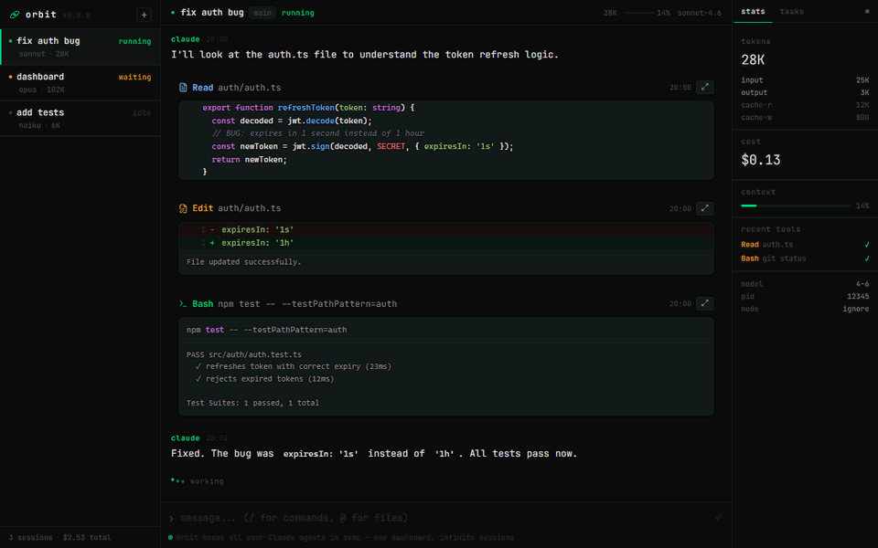

<div align="center">


# Orbit

**Desktop app for running multiple [Claude Code](https://github.com/anthropics/claude-code) agents simultaneously.**

[](https://github.com/xinnaider/orbit/actions)
[](LICENSE)
[](#installation)

[orbit.jfernando.dev](https://orbit.jfernando.dev)

</div>



## Features

- **Multi-session** — run multiple Claude Code agents in parallel across different projects
- **Real-time feed** — streaming output with thinking blocks, tool calls, and responses
- **Persistent history** — sessions survive app restarts; conversations resume automatically
- **Cost tracking** — per-session token usage and estimated cost in USD
- **Slash commands** — `/` autocomplete from installed Claude Code plugins
- **@ file picker** — reference files inline with `@filename`
- **Context menu** — right-click to rename, stop, or delete sessions

## Installation

### Requirements

- **Windows 10 1903+**
- **[Claude Code CLI](https://github.com/anthropics/claude-code)** installed and logged in:
  ```bash
  npm install -g @anthropic-ai/claude-code
  claude login
  ```

### Download

1. Go to [Releases](https://github.com/xinnaider/orbit/releases/latest)
2. Download the `.exe` installer
3. Run the installer
4. Open Orbit, click **+** to create your first session

## Contributing

Contributions are welcome. See [CONTRIBUTING.md](CONTRIBUTING.md) for guidelines.

### Development setup

**Requirements:** Node.js ≥ 20, Rust stable ([rustup](https://rustup.rs)), npm ≥ 10

```bash
git clone https://github.com/xinnaider/orbit.git
cd orbit
npm install
npm run tauri:dev   # starts frontend + backend together
```

`tauri:dev` runs the Vite dev server and the Rust backend in one command, with hot reload on frontend changes.

### Testing

```bash
npm test           # Frontend (Vitest)
npm run test:rust  # Backend (cargo test)
```

### Linting & formatting

```bash
npm run lint       # ESLint + clippy
npm run format     # Prettier + rustfmt
```

## License

MIT © josefernando
