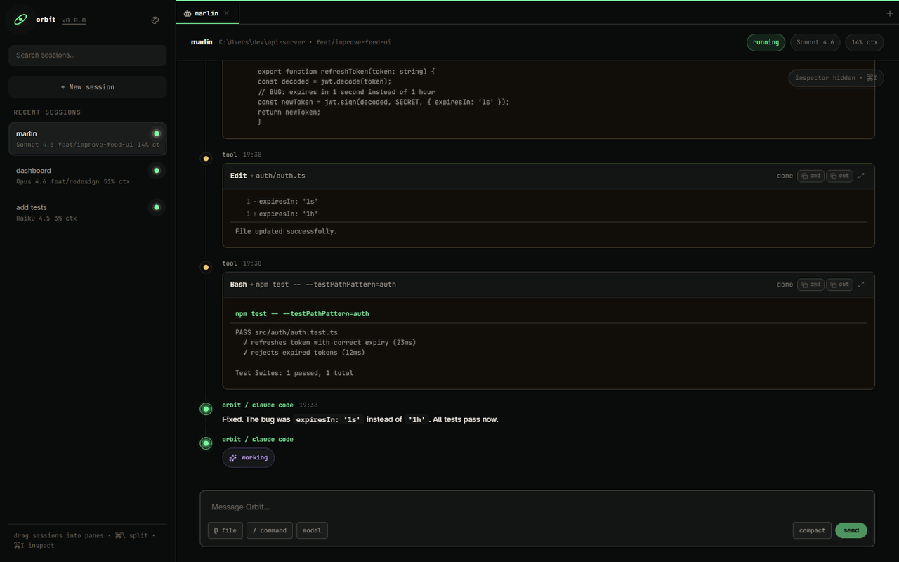

<div align="center">


# Orbit

**Run Claude Code, Codex, and OpenCode side by side — one desktop.**

Split panes, live feed, git worktrees, SSH sessions, and a browser dashboard for your phone.

<br />

[](https://orbit.jfernando.dev)
[](LICENSE)

<br />

[Download](#download) · [What you get](#what-you-get) · [Web access](#web-access)

</div>

<br />



---

## What you get

| | |
|---|---|
| **Multi-provider** | Claude Code, Codex, and OpenCode in the same window |
| **Split layout** | Drag panes, run several agents at once |
| **Live feed** | Streaming output, tool calls, diffs, and markdown |
| **Git worktrees** | Each session on its own branch — local or over SSH |
| **SSH remote** | Run agents on a server, control from your Mac or PC |
| **Auto-update** | New versions install themselves |

---

## Download

You need at least one CLI installed first:

| Provider | Install |
|----------|---------|
| Claude Code | `npm install -g @anthropic-ai/claude-code` then `claude login` |
| Codex | `npm install -g @openai/codex` |
| OpenCode | `go install github.com/opencode-ai/opencode@latest` |

### macOS 13+

```bash
curl -fsSL https://raw.githubusercontent.com/xinnaider/orbit/master/scripts/install-macos.sh | bash
```

Intel and Apple Silicon. Orbit lands in **Applications**.

### Windows 10 1903+

```powershell
irm https://raw.githubusercontent.com/xinnaider/orbit/master/scripts/install-windows.ps1 | iex
```

Opens from the Start Menu when the installer finishes.

### Linux (Ubuntu 22.04+, Debian, KDE, …)

```bash
curl -fsSL https://raw.githubusercontent.com/xinnaider/orbit/master/scripts/install-linux.sh | bash
```

Creates a desktop entry. Run from the app launcher or:

```bash
~/.local/share/orbit/orbit.AppImage
```

> Needs `curl` and `fuse2`. On Ubuntu: `sudo apt install fuse libfuse2`

---

## Web access

Turn on **Phone** in the sidebar, create an access key, scan the QR code. Use the same dashboard from a phone or tablet on your local network — create sessions, send messages, watch agents live.

---

## MCP orchestrator

Orbit ships with `orbit-mcp` so any MCP-capable agent can spawn and talk to other agents. No extra setup — it wires in when a session starts.

---

<div align="center">

**[orbit.jfernando.dev](https://orbit.jfernando.dev)** · MIT · built by [xinnaider](https://github.com/xinnaider)

</div>
